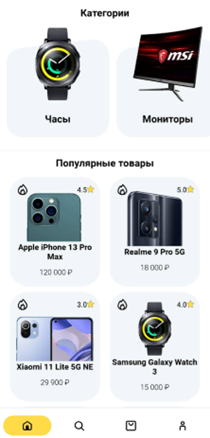
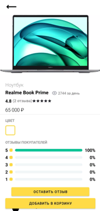
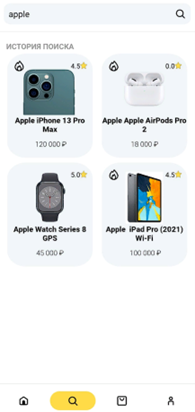
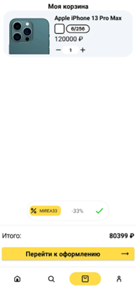
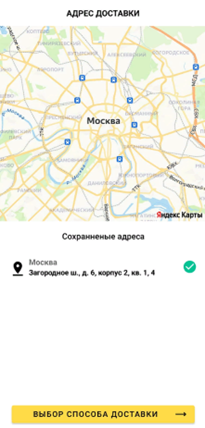
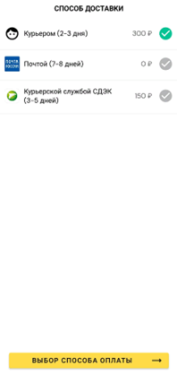
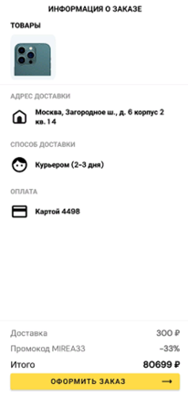
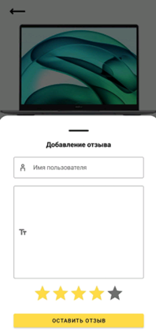

# 🛒 TechFate

<p align="center">
  
  
  
  
  
</p>

<p align="center">
  Android-приложение интернет-магазина электроники с каталогом товаров, поиском, корзиной, оформлением заказа и личным кабинетом.
</p>

<p align="center">
  
</p>

## 📱 About

TechFate — учебное Android-приложение интернет-магазина техники.

Приложение позволяет пользователю зарегистрироваться, просматривать категории и карточки товаров, выполнять поиск, читать и оставлять отзывы, добавлять товары в корзину и проходить полный сценарий оформления заказа.

Для хранения пользователей, корзин, заказов и товаров используется локальная база данных SQLite.

Интерфейс приложения был предварительно спроектирован в Figma, а клиентская часть реализована на Java с использованием Android Views.

## ✨ Features

- 🔐 Регистрация и авторизация
- 🔑 Сброс и изменение пароля
- 📜 Пользовательское соглашение
- 🏠 Главная страница с категориями и популярными товарами
- 🔎 Поиск товаров
- 🕘 История поисковых запросов
- 📂 Просмотр товаров по категориям
- 📱 Детальная карточка товара
- 🖼 Полноэкранный просмотр изображений
- ⭐ Просмотр рейтинга и отзывов
- 💬 Добавление собственного отзыва
- 🛒 Добавление и удаление товаров из корзины
- 🔢 Изменение количества товаров
- 🏷 Применение промокода
- 👤 Личный кабинет пользователя
- ✏️ Изменение данных профиля
- 📦 История и просмотр заказов
- 🗺 Выбор адреса доставки через Yandex MapKit
- 🚚 Выбор способа доставки
- 💳 Сохранение и выбор банковской карты
- 💰 Выбор способа оплаты
- ✅ Подтверждение заказа
- 📋 Просмотр статуса оплаты и заказа
- 🛡 Отдельные административные возможности для управления заказами

## 🏠 Home & Catalog

Главный экран содержит два списка на базе RecyclerView.

Первый показывает категории товаров, второй — популярные товары с изображением, названием, ценой и рейтингом.

При выборе категории открывается отдельный экран со списком соответствующих товаров. При выборе товара пользователь переходит на его детальную страницу.

<p align="center">
  
  
  
</p>

## 🔎 Search

Поиск реализован через AutoCompleteTextView.

Приложение показывает подсказки во время ввода и хранит историю поисковых запросов. Результаты отображаются отдельным списком товаров.

<p align="center">
  
</p>

## 🛒 Cart

Корзина хранит выбранные товары, их количество, цвет и конфигурацию.

Пользователь может изменять состав корзины, применять промокод и переходить к оформлению заказа.

<p align="center">
  
</p>

## 📦 Checkout

Оформление заказа разбито на несколько последовательных экранов.

Пользователь выбирает адрес доставки, способ доставки, способ оплаты, проверяет итоговую информацию и подтверждает заказ.

Для выбора адреса используется Yandex MapKit.

<p align="center">
  
  
  
  
</p>

## 💳 Payment

В приложении реализован интерфейс управления банковскими картами.

Пользователь может добавить карту, изменить ее данные и выбрать сохраненную карту при оформлении заказа.

Для форматированного ввода данных карты были реализованы собственные TextWatcher-классы:

- CardNumTextWatcher
- CardDateTextWatcher
- CardHolderTextWatcher

<p align="center">
  
  
</p>

## ⭐ Reviews

На странице товара отображается пользовательский рейтинг и отзывы.

Пользователь может открыть BottomSheet, выставить оценку и оставить текстовый отзыв.

<p align="center">
  
  
</p>

## 👤 Profile

В личном кабинете отображаются:

- фотография пользователя
- ФИО
- email
- последние заказы
- переход к изменению данных профиля
- выход из аккаунта

Для администратора дополнительно доступно управление заказами пользователей.

<p align="center">
  
  
</p>

## 🏗 Application structure

Приложение построено вокруг нескольких Activity, каждая из которых отвечает за отдельный пользовательский сценарий.

Основные Activity:

```text
MainActivity
LoginActivity
ItemCartActivity
CategoryActivity
FullScreenImageActivity
ChangeProfileInfoActivity
ShowOrdersActivity
PaymentActivity
```

Внутри Activity используются Fragment и отдельные Navigation Graph для разных сценариев приложения:

```text
login_navigation
nav_graph
payment_nav_graph
```

Такое разделение позволяет отделить авторизацию, основной интерфейс и процесс оформления заказа.

## 🧭 Navigation

Для навигации используется Android Jetpack Navigation.

Навигация разделена на несколько графов:

- регистрация, вход и восстановление пароля
- основные экраны приложения
- оформление и оплата заказа

Между отдельными крупными сценариями выполняется переход между Activity.

## 🗄 Data storage

Приложение использует две локальные SQLite-базы.

### User database

Хранит данные, связанные с пользователем и заказами:

```text
User
Addresses
Cards
Order
OrderCart
ProductsInOrder
ProductsInUserCart
UserCart
```

Для работы с данными используется UserDatabaseHelper.

Он отвечает за регистрацию и вход, изменение профиля и пароля, работу с адресами, картами, корзиной и заказами.

### Product database

Хранит каталог товаров и связанную с ним информацию:

```text
products
products_colors
products_configurations
products_images
products_reviews
```

Для работы с этой базой используется ProductDatabaseHelper.

## 🧩 Domain models

В проекте реализованы собственные модели данных:

```text
User
Cart
Card
Order
Product
ProductInCart
Category
Review
```

Часть моделей реализует Parcelable для передачи объектов между Android-компонентами.

## 🛡 Roles

В приложении предусмотрено разделение возможностей пользователя и администратора.

Обычный пользователь может работать с каталогом, корзиной, профилем и своими заказами.

Администратор дополнительно получает доступ к списку заказов пользователей и может изменять их статус.

## 🗺 Maps

Для выбора адреса доставки интегрирован Yandex MapKit.

Пользователь может выбрать точку на карте, после чего приложение позволяет указать данные адреса и сохранить его для дальнейших заказов.

## 🛠 Tech Stack

### Android

- Java
- Android SDK
- Android Views / XML
- Activities
- Fragments
- RecyclerView
- Parcelable
- BottomSheet / DialogFragment
- Android Jetpack Navigation

### UI

- Material Components
- AppCompat
- Figma

### Data

- SQLite
- SQLiteOpenHelper

### Maps

- Yandex MapKit

### Tooling

- Android Studio Flamingo 2022.2.1
- Gradle

## 📦 Dependencies

Основные зависимости проекта:

```text
androidx.appcompat:appcompat:1.6.1
com.google.android.material:material:1.4.0
androidx.navigation:navigation-fragment:2.5.3
androidx.navigation:navigation-ui:2.5.3
com.yandex.android:maps.mobile:4.3.1-lite
```

## 📱 Screenshots

<p align="center">
  
  
  
  
</p>

<p align="center">
  
  
  
  
</p>

## 📂 Recommended docs structure

```text
docs/
├── gif/
│   └── demo.gif
└── images/
    ├── preview.png
    ├── home.png
    ├── search.png
    ├── cart.png
    ├── profile.png
    ├── category.png
    ├── product.png
    ├── review.png
    ├── address.png
    ├── delivery.png
    ├── payment.png
    ├── card.png
    ├── order.png
    ├── payment_success.png
    └── edit_profile.png
```

## 📱 Requirements

- Android 5.1 (API 22) or newer
- Target SDK 33
- Internet connection is required for Yandex MapKit

## 🎯 Purpose

TechFate was developed as a course project for the Android mobile development discipline.

The project was created to practice building a complete multi-screen Android application, including UI design, navigation, local data storage, role-based functionality and a multi-stage checkout flow.

## 👨‍💻 Author

Fedor Shmakov
